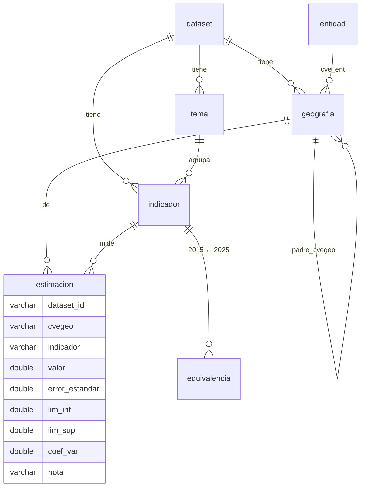
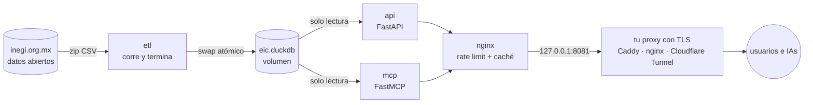

# EIC · API + MCP

**La Encuesta Intercensal del INEGI (2015 y 2025) como API pública y como servidor MCP para IAs.**

Un ETL descarga los paquetes de datos abiertos directamente de INEGI y los normaliza en una base DuckDB. Sobre esa base corren una API REST de solo lectura y un servidor [MCP](https://modelcontextprotocol.io) para que asistentes como Claude, ChatGPT o Cursor consulten los datos.


[](LICENSE)

## 🌐 Ya está en línea, úsalo sin montar nada

| Qué | URL |
|---|---|
| Documentación interactiva (Swagger) | **https://eic.datzin.com.mx/api/docs** |
| Esquema OpenAPI | https://eic.datzin.com.mx/api/openapi.json |
| API REST | `https://eic.datzin.com.mx/api/…` |
| Servidor MCP (streamable HTTP, sin autenticación) | **`https://eic.datzin.com.mx/mcp`** |

Es gratis y abierto, con límite de peticiones por IP. Si necesitas más volumen o quieres tu propia copia, [móntalo tú mismo](#-móntalo-tú-mismo).

## ⚡ Pruébalo

```sh
# Población 2025 de todas las entidades
curl "https://eic.datzin.com.mx/api/datasets/eic2025_localidades/datos?indicador=POBTOT&nivel=entidad"

# ¿Qué indicadores hay sobre desplazamiento forzado? (la búsqueda ignora acentos)
curl "https://eic.datzin.com.mx/api/datasets/eic2025_localidades/indicadores?q=desplazamiento"

# Busca una localidad y su clave geográfica
curl "https://eic.datzin.com.mx/api/datasets/eic2025_localidades/geografias?nivel=localidad&q=tijuana"

# Los 10 municipios de Jalisco con más población sin afiliación a servicios de salud
curl "https://eic.datzin.com.mx/api/datasets/eic2025_localidades/ranking?indicador=PCN_PSINDER&nivel=municipio&cve_ent=14"

# Ficha de Zapopan frente a Jalisco y el país, enfocada en carencias sociales
curl "https://eic.datzin.com.mx/api/datasets/eic2025_localidades/perfil/141200000?conjunto=vulnerabilidad"

# ¿Qué cambió en Jalisco entre 2015 y 2025?
curl "https://eic.datzin.com.mx/api/evolucion?cve_ent=14"
```

Cada estimación trae su precisión estadística:

```json
{
  "cvegeo": "010000000",
  "nombre": "Aguascalientes",
  "nivel": "entidad",
  "indicador": "POBTOT",
  "indicador_nombre": "Población en viviendas particulares habitadas",
  "valor": 1534416.0,
  "error_estandar": 58302.68,
  "lim_inf": 1438496.15,
  "lim_sup": 1630335.85,
  "coef_var": 3.8,
  "nota": null
}
```

### Rutas de la API

Todas son `GET`.

| Ruta | Parámetros |
|---|---|
| `/api/datasets` | |
| `/api/entidades` | |
| `/api/datasets/{id}/temas` | |
| `/api/datasets/{id}/indicadores` | `tema`, `q` |
| `/api/datasets/{id}/geografias` | `nivel`, `cve_ent`, `q`, `limit`, `offset` |
| `/api/datasets/{id}/datos` | `indicador` (obligatorio; varios separados por coma), `cvegeo`, `nivel`, `cve_ent`, `limit` (≤ 10 000), `offset` |
| `/api/ubicar` | `q` (`Zapopan`, `Juárez, Chihuahua`, `CDMX`…), `dataset` |
| `/api/datasets/{id}/ranking` | `indicador`, `nivel`, `cve_ent`, `orden` (`desc`/`asc`), `n` (≤ 100), `excluir_baja_precision` |
| `/api/datasets/{id}/perfil/{cvegeo}` | `indicador`, `tema`, `conjunto` (`destacados`/`vulnerabilidad`): el lugar junto a su entidad y el país |
| `/api/datasets/{id}/comparar` | `cvegeo` (2 a 10, separados por coma), `indicador`, `tema` |
| `/api/datasets/{id}/brecha-genero/{cvegeo}` | `tema`: indicadores de mujeres frente a hombres |
| `/api/evolucion` | `cve_ent` (`00` = nacional), `tema`: cambios 2015 → 2025 con indicadores equivalentes |
| `/api/equivalencias` | Pares curados de indicadores comparables entre 2015 y 2025 |

`nivel` acepta `nacional`, `entidad`, `municipio`, `localidad`, `resto_localidades` o `distrito`. `tema` acepta el id o parte del nombre (`vivienda`, `educacion`).

## 🤖 Conecta tu IA (MCP)

Usa la instancia pública `https://eic.datzin.com.mx/mcp`, o la URL de tu propia instancia si lo montas.

<details open>
<summary><b>Cursor, Windsurf y clientes con soporte HTTP</b> (<code>mcp.json</code>)</summary>

```json
{
  "mcpServers": {
    "eic": {
      "url": "https://eic.datzin.com.mx/mcp"
    }
  }
}
```
</details>

<details>
<summary><b>VS Code</b> (<code>.vscode/mcp.json</code>)</summary>

```json
{
  "servers": {
    "eic": {
      "type": "http",
      "url": "https://eic.datzin.com.mx/mcp"
    }
  }
}
```
</details>

<details>
<summary><b>Claude Desktop</b> (<code>claude_desktop_config.json</code>, usa el puente <a href="https://www.npmjs.com/package/mcp-remote">mcp-remote</a>)</summary>

```json
{
  "mcpServers": {
    "eic": {
      "command": "npx",
      "args": ["-y", "mcp-remote", "https://eic.datzin.com.mx/mcp"]
    }
  }
}
```

También puedes agregarlo sin JSON: en claude.ai o Claude Desktop, Configuración → Conectores → Agregar conector personalizado.
</details>

<details>
<summary><b>Claude Code</b></summary>

```sh
claude mcp add --transport http eic https://eic.datzin.com.mx/mcp
```
</details>

<details>
<summary><b>Codex</b> (<code>~/.codex/config.toml</code>)</summary>

```toml
[mcp_servers.eic]
url = "https://eic.datzin.com.mx/mcp"
```

O desde la terminal: `codex mcp add eic --url https://eic.datzin.com.mx/mcp`
</details>

<details>
<summary><b>ChatGPT</b></summary>

1. Activa el modo desarrollador en Configuración → Aplicaciones y conectores → Configuración avanzada.
2. Crea un conector con la URL `https://eic.datzin.com.mx/mcp`.
3. Elige autenticación: "Sin autenticación".
</details>

<details>
<summary><b>Local por stdio</b> (si clonaste el repo y corriste el ETL)</summary>

```json
{
  "mcpServers": {
    "eic": {
      "command": "uv",
      "args": ["--directory", "/ruta/a/EIC-API-MCP", "run", "python", "-m", "eic.mcp_server"]
    }
  }
}
```
</details>

### Tools

| Tool | Qué hace |
|---|---|
| `ubicar_lugar` | Convierte un nombre (`Zapopan`, `Juárez, Chihuahua`, `CDMX`) en su clave `cvegeo` |
| `perfil_lugar` | Ficha de un lugar frente a su entidad y el país; indicadores destacados, de un tema o de vulnerabilidad social |
| `comparar_lugares` | Tabla indicador × lugar para 2 a 10 lugares |
| `ranking` | Los mayores o menores valores de un indicador en un nivel, opcionalmente dentro de una entidad |
| `brecha_genero` | Indicadores de mujeres frente a hombres en un lugar |
| `evolucion_2015_2025` | Cambios entre encuestas con indicadores equivalentes, indicando si la diferencia es estadísticamente clara |
| `listar_datasets`, `buscar_indicadores`, `buscar_geografias`, `obtener_datos` | Exploración y datos crudos |

Todas son de solo lectura. Cada cifra trae su `precision` según el criterio de INEGI, y el servidor le indica al modelo que no presente como sólidas las estimaciones con muestra insuficiente.

### Prompts (pre-consultas)

Son análisis guiados que el cliente te ofrece con un formulario y autocompletado de lugares, temas e indicadores. En Claude Code aparecen como comandos `/mcp__eic__<prompt>`; en Claude Desktop, en el botón **+** → EIC. ChatGPT y Codex no muestran prompts, pero puedes pedirles lo mismo con tus palabras (ver ejemplos abajo).

| Prompt | Argumentos | Qué hace |
|---|---|---|
| `guia_rapida` | | Explica qué datos hay y sugiere preguntas |
| `perfil_lugar` | `lugar` | Perfil sociodemográfico frente a la entidad y el país |
| `comparar_lugares` | `lugares` (separados por `;`), `tema` | Comparación lado a lado |
| `ranking` | `indicador`, `nivel`, `entidad`, `orden` | Los lugares con valores más altos o más bajos |
| `explorar_tema` | `tema`, `anio` | Qué mide un tema, panorama nacional y entidades extremas |
| `brecha_genero` | `lugar`, `tema` | Diferencias entre mujeres y hombres |
| `vulnerabilidad_social` | `lugar` | Carencias en salud, educación, alimentación, vivienda, empleo y desplazamiento |
| `evolucion_2015_2025` | `entidad` | Qué cambió entre la Intercensal 2015 y la 2025 |
| `ficha_distrito` | `entidad`, `distrito` | Perfil de un distrito electoral federal (2015) |

### Resources

| URI | Contenido |
|---|---|
| `eic://guia` | Guía metodológica: precisión, claves geográficas y comparabilidad |
| `eic://datasets/{dataset}/diccionario` | Indicadores de cada dataset agrupados por tema |
| `eic://equivalencias` | Pares de indicadores comparables entre 2015 y 2025 |
| `eic://entidades` | Catálogo de entidades federativas |

## 💬 Qué le puedes pedir a tu IA

Con el conector activo, pregunta en lenguaje natural; la IA elige las tools. Funciona igual en ChatGPT, Claude, Codex o Claude Code.

**Perfiles y comparaciones**
- *Hazme el perfil sociodemográfico de Zapopan y compáralo con Jalisco y con el país.*
- *Compara Monterrey, Guadalajara y Puebla en vivienda: drenaje, internet y hacinamiento.*
- *¿Cómo es Tijuana frente al resto de Baja California en educación y empleo?*

**Rankings**
- *¿Cuáles son los 10 municipios de Oaxaca con mayor porcentaje de población sin afiliación a servicios de salud? Excluye las estimaciones poco precisas.*
- *¿En qué estados es mayor el desplazamiento forzado por inseguridad?*
- *¿Qué localidades de 50 mil habitantes o más tienen menos acceso a internet?*

**Temas específicos**
- *Hazme un diagnóstico de vulnerabilidad social de Ecatepec de Morelos.*
- *¿Cuál es la brecha de género en escolaridad y participación económica en Chiapas?*
- *Explícame qué mide la Intercensal 2025 sobre alimentación y dónde hay más hogares sin acceso a alimentos.*

**2015 contra 2025**
- *¿Qué cambió en Yucatán entre la Intercensal 2015 y la 2025? Solo dame los cambios estadísticamente claros.*
- *¿Cuánto creció el acceso a internet en cada entidad desde 2015?*
- *¿Qué distritos electorales de Chiapas eran indígenas en 2015 y cómo era su escolaridad?*

**En Claude Code o Codex, combinando datos y código**
- *Con el MCP eic, arma un CSV con el porcentaje de viviendas con internet por municipio de Jalisco y grafícalo con matplotlib.*
- *Usa el MCP eic para generar un notebook que compare los 32 estados en los indicadores de vulnerabilidad social.*
- *Con el prompt `/mcp__eic__perfil_lugar`, haz la ficha de Mérida y guárdala como `merida.md`.*

> [!TIP]
> En ChatGPT, activa el conector desde el menú de herramientas de la conversación o menciónalo: *"Usa EIC para…"*. Si la IA mezcla años, pídele explícitamente *"con la Intercensal 2025"*.

## 📊 Datos

| Dataset | Fuente INEGI | Desagregación | Indicadores |
|---|---|---|---|
| `eic2025_localidades` | [EIC 2025](https://www.inegi.org.mx/programas/eic/2025/), principales resultados por localidad de 50 000 y más habitantes | Nacional, 32 entidades, 2,478 municipios, 233 localidades | 341 en 16 temas |
| `eic2015_distritos` | [EIC 2015](https://www.inegi.org.mx/programas/intercensal/2015/), estadísticas a escalas geoelectorales | Nacional, 32 entidades, 300 distritos electorales federales | 107 en 9 temas |

> [!IMPORTANT]
> Son **estimaciones por muestreo**. Según el criterio de INEGI, un coeficiente de variación (CV) menor a 15 indica precisión alta, de 15 a 30 moderada, y mayor a 30 baja.
> `nota = MI` significa que el dato no está disponible por muestra insuficiente; `NA`, que no aplica.
> 2015 y 2025 solo son comparables a nivel nacional y por entidad, porque usan geografías distintas y sus códigos de indicador difieren.

### Modelo

Usa formato largo: una fila por dataset, geografía e indicador. Así cualquier consulta funciona igual sin importar si el CSV original tenía 349 o 540 columnas.



El esquema completo está en [`src/eic/schema.sql`](src/eic/schema.sql). Los temas de 2015 se asignan con los mismos nombres que en 2025, y las equivalencias entre años son una tabla curada en [`src/eic/equivalencias.csv`](src/eic/equivalencias.csv): 29 pares marcados como `exacta` o `aproximada`, con una nota cuando cambió la definición. El ETL también exporta cada tabla a Parquet en `data/parquet/`, por si prefieres analizar los datos con pandas, polars o DuckDB directamente.

## 🧱 Arquitectura



## 🐳 Móntalo tú mismo

Solo necesitas Docker con Compose v2.

```sh
git clone https://github.com/zamax14/EIC-API-MCP.git
cd EIC-API-MCP
docker compose up -d --build
```

Al arrancar, compose levanta todo en este orden:

1. **`etl`** descarga los datos de INEGI, construye la base en un volumen y termina.
2. **`api`** y **`mcp`** arrancan solo si el ETL terminó bien, y abren la base en solo lectura.
3. **`nginx`** las expone en `http://127.0.0.1:8081`: la API en `/api` y el MCP en `/mcp`.

```sh
curl http://127.0.0.1:8081/api/datasets   # comprobar
```

### Publicarlo con tu dominio

nginx solo escucha en `127.0.0.1`. Para exponerlo pon delante un proxy con TLS que reenvíe todo tu dominio, o las rutas `/api` y `/mcp`, a `http://127.0.0.1:8081`. Por ejemplo:

**Caddy** (obtiene el certificado HTTPS solo):

```caddy
eic.tudominio.com {
    reverse_proxy 127.0.0.1:8081
}
```

**Cloudflare Tunnel:** en el panel del túnel, agrega un *public hostname* con tipo de servicio `HTTP` y URL `localhost:8081`. Usa `HTTP`, no `HTTPS`: el TLS lo pone Cloudflare.

nginx toma la IP real del cliente de `X-Forwarded-For`, que mandan estos proxies, así que el límite se aplica a cada usuario y no al proxy.

### Configuración

Las variables se definen en el entorno o en un archivo `.env` junto a `compose.yaml`.

| Variable | Default | Qué controla |
|---|---|---|
| `EIC_PORT` | `8081` | Puerto local de nginx (solo en 127.0.0.1) |
| `EIC_DB_MEMORY` | `384MB` | Memoria máxima de DuckDB por proceso |
| `EIC_DB_THREADS` | `2` | Hilos de DuckDB por proceso |

Los límites contra abuso están en [`deploy/nginx.conf`](deploy/nginx.conf) y en [`compose.yaml`](compose.yaml):

| Capa | Protección |
|---|---|
| nginx | 5 req/s por IP con ráfaga de 20 y 10 conexiones simultáneas por IP; lo que excede recibe `429` |
| nginx | Caché de 10 min para la API (los datos solo cambian con el ETL); solo GET en `/api` y cuerpo de 64 KB como máximo en `/mcp` |
| API / MCP | Concurrencia acotada por worker, máximo 10 000 filas por página (500 en el MCP), parámetros validados y SQL siempre parametrizado |
| DuckDB | Base en solo lectura con memoria e hilos limitados por proceso |
| Contenedores | Memoria y CPU acotadas; usuario sin privilegios |

Si cambias `deploy/nginx.conf`, aplica la configuración con `docker compose up -d --force-recreate nginx`.

### Actualizar los datos

```sh
docker compose run --rm etl
```

El ETL se salta las descargas que no cambiaron. La API y el MCP detectan la base nueva sin reiniciar. Para programarlo cada semana con cron:

```cron
0 4 * * 1  cd /ruta/a/EIC-API-MCP && docker compose run --rm etl >> /var/log/eic-etl.log 2>&1
```

## 🛠️ Desarrollo local

Requiere [uv](https://docs.astral.sh/uv/).

```sh
uv sync
uv run python -m eic.etl                    # descarga de INEGI y construye data/eic.duckdb (~5 s)
uv run uvicorn eic.api:app --reload         # API en http://localhost:8000/docs
uv run python -m eic.mcp_server             # MCP por stdio
uv run python tests/test_etl.py && uv run python tests/test_api.py && uv run python tests/test_mcp.py
```

`python -m eic.etl --offline` reconstruye la base con los zips que ya están en `data/raw`, sin descargar. `EIC_DB` cambia la ruta de la base.

Para agregar otro paquete de datos abiertos de INEGI, añade una entrada a `SOURCES` en [`src/eic/etl.py`](src/eic/etl.py) con su URL y su parser.

## 📄 Licencia, fuente y créditos

Código bajo licencia [MIT](LICENSE).

Datos: **INEGI, Encuesta Intercensal 2015 y 2025**, usados conforme a los [términos de libre uso de la información del INEGI](https://www.inegi.org.mx/inegi/terminos.html). Este proyecto no está afiliado al INEGI. Si citas los datos, menciona a INEGI como fuente.
